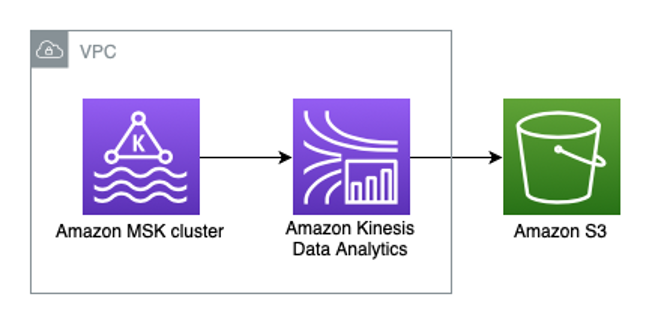

## Architecture for Architecture for AWS Streaming Data Solution for Amazon MSK
The solution implements three patterns with more coming soon. All of them use Amazon MSK for streaming storage, and you can combine and extend the different components (which are built using the AWS CDK) to meet your needs.

### Networking configuration
We recommend launching the Amazon MSK cluster in private subnets (where the default route points to a NAT gateway), as this networking setup is required if you plan to use AWS Lambda or Amazon Kinesis Data Analytics to read data from the cluster.
For more details, refer to [Adding an Amazon MSK cluster as an event source](https://docs.aws.amazon.com/lambda/latest/dg/services-msk-topic-add.html#services-msk-vpc-config) and [Internet and Service Access for a VPC-Connected Kinesis Data Analytics application](https://docs.aws.amazon.com/kinesisanalytics/latest/java/vpc-internet.html).

If you don't have an Amazon VPC following this pattern, you can use the [Modular and Scalable VPC Architecture](https://aws.amazon.com/quickstart/architecture/vpc/), which provides a networking foundation based on AWS best practices and guidelines.

### 1st pattern


The first pattern includes an Amazon MSK cluster and Amazon EC2 instance that contains the Apache Kafka client libraries required to communicate with the MSK cluster (this client machine will be located on the same Amazon VPC as the cluster, and it can be accessed via AWS Systems Manager Session Manager). Also included is an Amazon CloudWatch dashboard to monitor the cluster health.


Once the stack is launched, you can use the client instance to create an Apache Kafka topic and produce data.

> **Note**: The following commands need to be run from the EC2 instance launched as part of the stack.

> **Note**: Cluster ARN is an output of the CloudFormation stack.

#### 1. Query ZooKeeper connection and Bootstrap servers
Run the _describe-cluster_ CLI command and save the value for the _ZookeeperConnectString_ property:
```
aws kafka describe-cluster --cluster-arn <cluster-arn> --region <aws-region>
```

Run the _get-bootstrap-brokers_ CLI command and save the value for the _BootstrapBrokerStringTls_ property:
```
aws kafka get-bootstrap-brokers --cluster-arn <cluster-arn> --region <aws-region>
```

#### 2. Create topic and produce data
> **Note**: If the command returns an _InvalidReplicationFactorException_, make sure the _replication-factor_ parameter is not larger than the number of available brokers.

```
sudo su
cd /home/kafka/bin

./kafka-topics.sh --create --zookeeper <ZookeeperConnectString> --replication-factor 2 --partitions 1 --topic MyTopic
./kafka-topics.sh --list --bootstrap-server <BootstrapBrokerStringTls> --command-config client.properties
./kafka-verifiable-producer.sh --bootstrap-server <BootstrapBrokerStringTls> --producer.config client.properties --topic MyTopic --throughput 100 --max-messages 500
```

> **Note**: For the following patterns, the topic must exist before the stack is launched. If it doesn't, Lambda and Kinesis will not be able to process any events.

### 2nd pattern


The second pattern includes an AWS Lambda function that consumes data from an Apache Kafka topic. The [function](/source/lambda/msk-lambda-consumer/index.js) is a Node.js application that logs the received messages, but it can be customized to your business needs.

### 3rd pattern


The third pattern includes an AWS Lambda function that consumes data from an Apache Kafka topic; an Amazon Kinesis Data Firehose delivery stream that buffers data before delivering it to the destination; and an Amazon S3 bucket that stores the output. The [function](/source/lambda/msk-lambda-kdf/index.js) will propagate the messages to Amazon S3 for backup and long term storage.

### 4th pattern


The fourth pattern includes an Amazon Kinesis Data Analytics application that reads data from an existing topic in Amazon MSK (using Apache Flink, which guarantees exactly-once processing) and saves the results to an Amazon S3 bucket.

The solution provides a [demo consumer application](/source/kinesis/kda-flink-kafka), in order to demonstrate how to use the Apache Flink Table API. The schema used is the same one provided in [Getting Started with Amazon Kinesis Data Analytics for Apache Flink (Table API)](https://docs.aws.amazon.com/kinesisanalytics/latest/java/gs-table-table.html):

```json
{
    "event_time": "2020-08-01 12:00:00",
    "ticker": "AMZN",
    "price": 50
}
```

By default, the demo consumer application will not run after the stack is launched. To start it, run the command below:

> **Note**: Application name is an output of the CloudFormation stack.

```
aws kinesisanalyticsv2 start-application --application-name <application-name> --run-configuration {}
```
